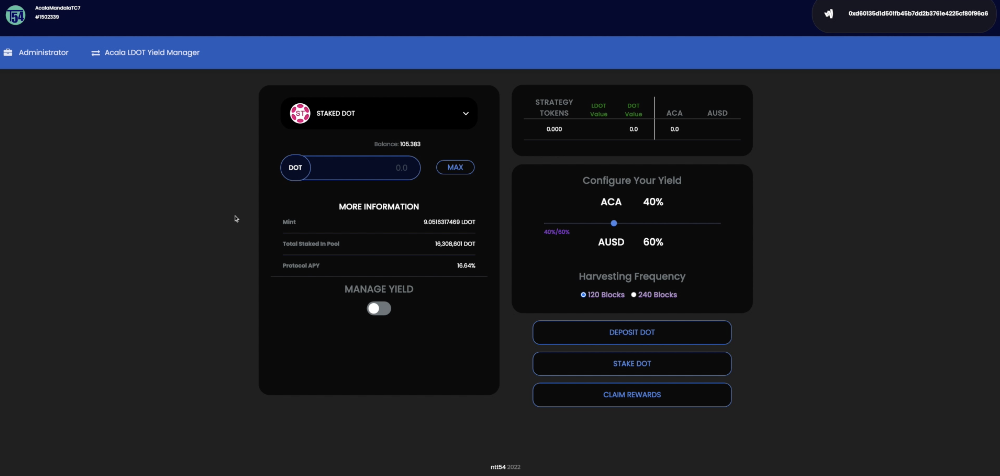
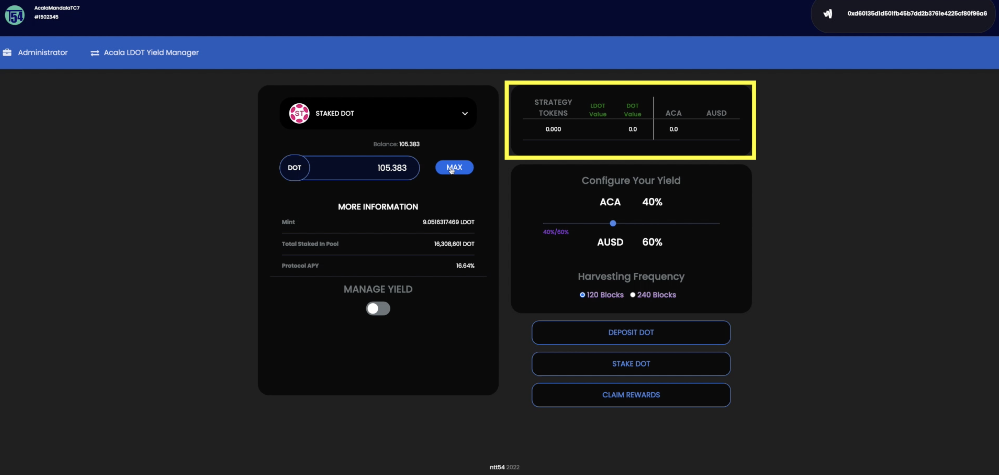
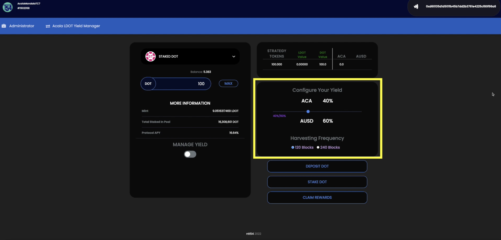
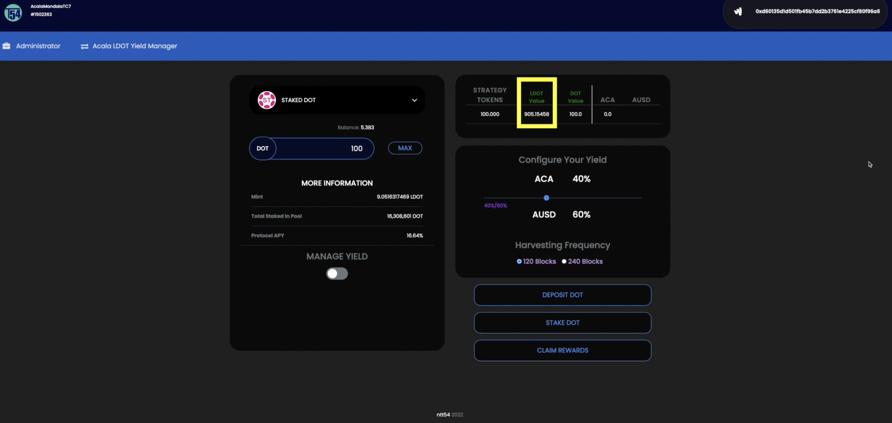
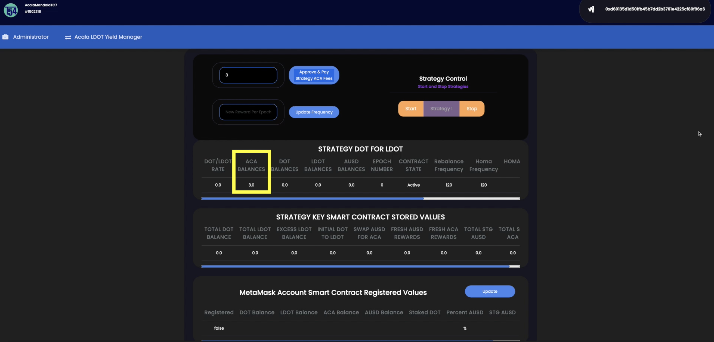
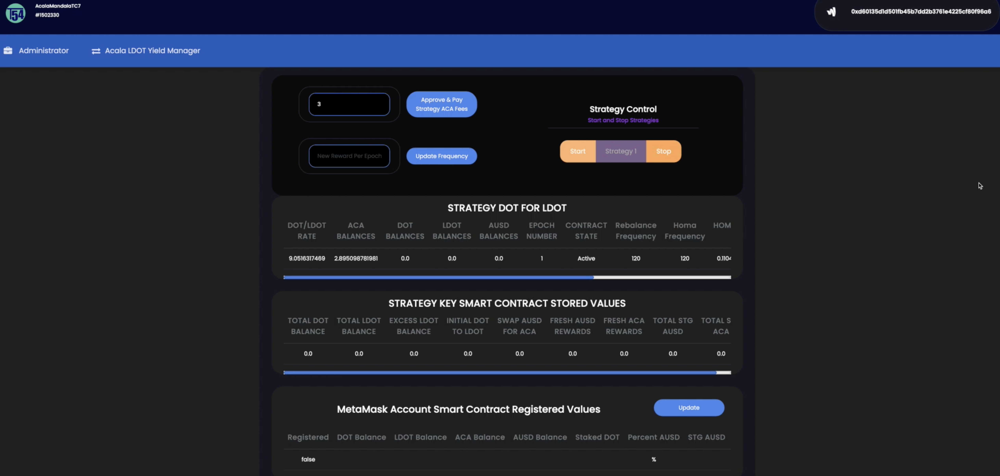

## Please use at your own risk. This a submission for bounty, not production/battle-tested and audited software.

<br>

# __Polkadot Hackathon: North America Edition__
## Acala Bounties - EVM+ DApp For aUSD Yield

<br>


<br>

## Table of Contents
1. [General Info](#general-info)
2. [Website](#website)
3. [ACALA LDOT YIELD MANAGER - Demo Video](#acala-bounty-demo-video)
5. [Installation](#installation)
6. [Using the Application](#using-the-application)
    * [ACALA LDOT YIELD MANAGER - Front End](#using-the-front-end)
    * [ACALA LDOT YIELD MANAGER - Admin Back End](#using-the-admin-back-end)

<br>

## General Info
***
<p>This repo contains a DApp that allows the user to create a regular Dollar Cost Average (DCA) investment strategy using the passive income from their staked LDOT.
<br>

### __Activities__
***
1. __Manage your LDOT staking yield automatically at pre-determined times.__
2. __Autoswap accumulated DOT yield for other assets on the Acala Platform, such as aUSD and/or ACA.__ 

<br>

### Supported Chains and Assets
***
### __Polkadot Ecosystem__
1. __Parachains__ 
    * ACALA
2. __Assets__
    * DOT
    * ACA
    * AUSD
    * LDOT

<br>

### Website
***
<p>
We have deployed a website 
<a href="" target="_blank">here</a>
to showcase our application and hackathon bounty submissions.
</p>
<p>
Please make sure you have the Metamask wallet chrome extension installed and connected to the Acala Mandala TC7 parachain.
</p>
<p>
The website is best viewed on screen resolutions above 2560x1440px. 
Any future versions will accomodate responsive frameworks + mobile.
</p>
<br>

### Acala Bounty Demo Video
***
<p> A demo video showing the features of the Acala LDOT Yield Manager can be found 
<a href="https://www.youtube.com/watch?v=7CvMfrqMNr4" target="_blank">here</a>.

This shows our work on the project for our submission for the Acala bounty. Please check it out!

</p>
<br>

### Installation
***
Create a new folder and inside it
```bash
$ git clone https://github.com/Entity54/AcalaLDOTYieldManager
$ cd AcalaLDOTYieldManager
$ yarn
$ npm start
```

<br>

### Using The Application
***
<br>
<p>
Using the Acala LDOT Yield Manager makes it easy to:

Manage your LDOT staking yield automatically at pre-determined times.
Autoswap accumulated DOT yield for other assets on the Acala Platform, such as aUSD and/or ACA.
The project makes extensive use of the Acala Scheduler, Acala DEX and Acala EVM to allow the user to choose the desired reinvestment strategy for their LDOT yield.
</p>
<p>
This application will allow the user to stake DOT for LDOT and then periodically take the accumulated LDOT yield and automatically swap it for other assets.

This allows the user to create a regular Dollar Cost Average (DCA) investment strategy using the passive income from their staked LDOT.
</p>

<br>

### Background Information:
We created a smart contract strategy that automates the monitoring and collecting of LDOT yield on a regular basis.

Whilst the amount of Staked LDOT from the user remains the same at all times, the value of that LDOT (in DOT) slowly appreciates over time. Using the Acala Scheduler to run regular sweeps of the excess yield that has accumulated, we then swap this excess DOT for another asset of the users choice using the Acala DEX before transferring it back to the user.

To showcase the project, the following assets and chains were included in the DApp:

LDOT / DOT / ACA / AUSD

ACALA (parachain)

Created for the following bounties of the Polkadot Hackathon North America Edition 2022:

ACALA - EVM+ DAPP FOR AUSD YIELD
</p>
<br>


### Using The Front End
***
<br>
<p>
Welcome to ACALA LDOT YIELD MANAGER.  

To begin with you must ensure that you connect and approve the Metamask extension pop ups when interacting with this website.    
Please also ensure that metamask is connected to the Acala Mandala TC7 chain. 

You can see the metamask wallets to be used at the top of the screen. If another metamask wallet is desired, please choose directly from within your metamask extension.  

Upon visiting the DApp, you can see that the screen is divided into two main sections:

- The left side of the screen is where the user interacts to deposit their dot tokens, in return for strategy tokens on the smart contract.   This side also shows information on the staking pool itself.   
- The right side of the screen is where the user configures all of the options for managing the yield from their dot staking before combining everything into a transaction to be submitted to the chain.  
<br>
<br>

<br>
<br>


As soon as the accounts are connected, the maximum DOT balance available to be deposited is shown on the left hand side of the screen.  

Clicking the "max" button will prefill the Quantity field with the maximum amount. 

Underneath, we can also see the current rate of LDOT that will be minted per one DOT staked, without commissions. 
Over on the right side of the screen, we start with a balance section at the top. 
<br>
<br>

<br>
<br>

This consists of ACA, AUSD and strategy tokens.  
For every one DOT that the user stakes for LDOT, one strategy token is minted.  
The upto date value of these strategy tokens (in dot and LDOT) is also displayed in green, in the table. 
The strategy tokens are visible in the users metamask wallet and act as a receipt of their deposit. 

 
Lets go ahead and deposit 100 dot into the smart contract. 
Click the deposit dot button and this will prompt two metamask transactions. 
The first one is to approve the strategy smart contract to perform a transfer. 
The second one is to instruct the smart contract to transfer one dot from the users metamask wallet and deposit it into the strategy smart contract. 

Once the transaction has mined we can see our newly minted strategy tokens in the balance section at the top of the screen along with the corresponding values in LDOT and dot. 

Currently, the LDOT balance will be zero as we have not staked the DOT yet,  we have only deposited it onto the smart contract. 
Before we stake the DOT for LDOT,  we must decide what we would like to do with the yield that we will accumulate in dot. 

In this instance we have decided that we would like to take our DOT yield and convert 40% of it into ACA and 60% into AUSD.  We have set the slider control accordingly.

Lastly, we would also like to set the frequency of the LDOT yield harvesting, to be every 120 blocks,  (approximately every 12 minutes). 
<br>
<br>

<br>
<br>

The user will need to decide on an optimal frequency to harvest the yield to achieve a good balance of Dollar Cost Averaging (DCA) Returns, whilst avoiding excessively frequent execution fees. 

Now we can go ahead and start the process by clicking the "stake dot" button and signing the metamask extension popup when it appears to approve the transaction.

After the transaction has mined, the user can see the representation of the strategy tokens,  in LDOT tokens in green in the balances section.
<br>
<br>

<br>
<br>

It is important to note that the users balance of LDOT in the strategy will initially be slightly less than than the corresponding DOT / LDOT rate shown on the left side of the screen, to account for the paid commission to the Acala Homa protocol.  Therefore, to begin with, the user will have to wait for a few harvesting cycles before showing a profit. 
 
Thats it for the front end demo,  lets take a quick look at whats happening in the administrator section on the back end. 


</p>
<br>

### Using The Admin Back End
***
<br>
<p>
Welcome to the Administrator page. 
This page is for monitoring the functionality of the strategy. 

To begin with the administrator has to transfer 3 ACA to the strategy smart contract,  which will be used for the Acala Scheduler and to cover swap fees. 
Two metamask transactions need to be completed to approve and the sign the actual transfer of the ACA tokens.
<br>
<br>

<br>
<br>

If the admin fills in and clicks the update frequency button they can change the frequency with which the strategy performs its checks. 

On the strategy control field, the admin can start or stop the strategy. 

Having started the strategy, we can now start seeing some valuable information.
On the first row we can see the dot / LDOT rate, the ACA balance that the strategy holds to pay the running costs, as well as the dot, LDOT and AUSD balances of the strategy. 

Please note that any ACA balances here will also include any ACA accrued by the strategy before being claimed by the user. 
The contract state tells us whether the strategy is currently active and further to the right we can see the Acala Homa Protocol frequency and the strategy frequency. 
We can see the epock number increasing and the ACA balance decreasing as the strategy performs periodic checks.  

The second rowe contains the actual values stored inside the smart contract allowing a simpler understanding of the mechanics at any time. 
 
Since the strategy mandate is to benefit from the continuously decreasing rate of DOT / LDOT,  it keeps as a reference, the dot deposited to the strategy smart contract and the resulting LDOT from minting via the Acala Homa Protocol.

During every periodic check,  if the homa epock of 120 blocks has elapsed,  then the DOT / LDOT rate will be decreased. This means that less LDOT are needed to redeem the initial deposited dot.  This also means that the strategy can calculate the excess LDOT and depending on each users preferences, swap it to AUSD and ACA accordingly. 
<br>
<br>

<br>
<br>

For each strategy token (STG in the smart contract), we track two variables. 
These are STG AUSD and STG ACA. 
If a user deposits 100 dot, they will receive 100 STG ERC20 tokens.  
This user may then choose to receive 40% ACA and 60% AUSD as the yield reward split, so we add 40 STG ACA and 60 STG AUSD to his personal variables in the smart contract. 
All of these variables are used to calculate each user's share of the claimed ACA and AUSD rewards and the users metamask details are also registered in the strategy smart contract. 

Thats it for this brief overview of the administrator page and some of the functionality available to the admin user. 
For more information please check out our smart contracts and documentation on Github. 
Thanks for watching. 

</p>
<br>

